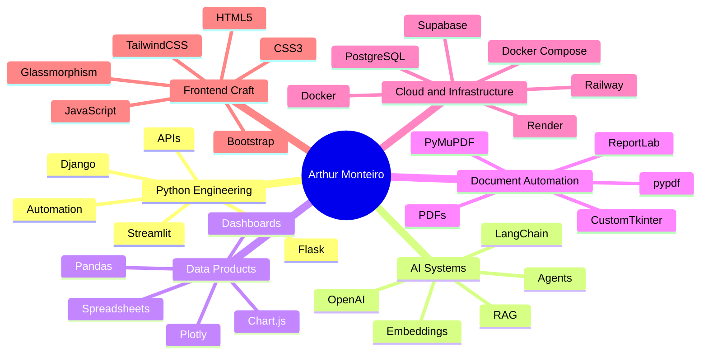

<!-- README.md | GitHub Profile: monteiro-lab -->
<!-- Feather icons are loaded through Icongram to keep the Feather style with color accents. -->

<div align="center">


<br/>


<br/><br/>


<br/><br/>

<a href="https://github.com/monteiro-lab">
  
</a>

<!-- Add your real links below when available -->
<!--
<a href="https://www.linkedin.com/in/YOUR-LINKEDIN">
  
</a>

<a href="mailto:your.email@example.com">
  
</a>
-->

</div>

---

##  About Me

I build software for the kind of problems that usually live inside spreadsheets, repetitive workflows, scattered documents, and manual business processes.

My work is centered around **Python**, with a strong focus on **automation**, **data products**, **AI-assisted systems**, **dashboards**, **PDF/document workflows**, and **backend applications** that are practical enough to be used outside a demo environment.

I like building tools that feel simple on the surface, but solve complex problems underneath: collecting data, processing files, integrating APIs, generating reports, connecting databases, and turning operational chaos into clean digital workflows.

Most of my projects come from a simple idea:  
**good software should save time, reduce friction, and make decisions easier.**

---

##  Engineering Focus

<table>
  <tr>
    <td width="50%">
      <h3>
        
        Backend that does the heavy lifting
      </h3>
      <p>
        I use Python to build web systems, APIs, authentication flows, background jobs, database models, and services that are designed to be useful, maintainable, and ready to evolve.
      </p>
    </td>
    <td width="50%">
      <h3>
        
        Data tools people can actually use
      </h3>
      <p>
        I turn CSVs, Excel files, APIs, and raw information into dashboards, reports, interactive charts, and workflows that make data easier to understand and act on.
      </p>
    </td>
  </tr>
  <tr>
    <td width="50%">
      <h3>
        
        AI where it makes sense
      </h3>
      <p>
        I work with LLMs, RAG pipelines, embeddings, vector databases, and automation flows to make AI useful inside real applications, not just as a chatbot layer.
      </p>
    </td>
    <td width="50%">
      <h3>
        
        Document and workflow automation
      </h3>
      <p>
        I build tools for PDFs, reports, document editing, extraction, merging, file processing, and repetitive office tasks that should not depend on manual work.
      </p>
    </td>
  </tr>
</table>

---

##  Tech Stack

<div align="center">

### Languages


<br/><br/>

### Backend, APIs and Databases


<br/><br/>

### Cloud and Workflow Tooling


<br/><br/>

### Frontend and UI


</div>

---

##  Stack DNA

<div align="center">


</div>

---

##  Featured Projects

<table>
  <tr>
    <td width="50%">
      <h3>
        
        CalendAI PRO
      </h3>
      <p>
        A scheduling system that brings AI into calendar workflows, combining Flask, LangChain, OpenAI, Supabase/PostgreSQL, Google OAuth, and Google Calendar API to make appointment management smarter and less manual.
      </p>
      <p>
        
        
        
        
        
        
      </p>
      <a href="https://github.com/ndmg-dev/CalendarAI_PRO">View repository</a>
    </td>
    <td width="50%">
      <h3>
        
        Ouvidoria MG
      </h3>
      <p>
        A corporate ombudsman platform built around authentication, structured data, AI search, and RAG. It connects Supabase, pgvector, OpenAI, n8n, and Docker to help transform internal knowledge into searchable, actionable answers.
      </p>
      <p>
        
        
        
        
        
      </p>
      <a href="https://github.com/ndmg-dev/ouvidoria-mg">View repository</a>
    </td>
  </tr>

  <tr>
    <td width="50%">
      <h3>
        
        Dollar Tracker
      </h3>
      <p>
        A Flask dashboard for tracking USD/BRL exchange rates with historical storage, scheduled updates, statistical analysis, and interactive charts, turning financial data into a clean monitoring experience.
      </p>
      <p>
        
        
        
        
        
      </p>
      <a href="https://github.com/monteiro-lab/dolar-tracker">View repository</a>
    </td>
    <td width="50%">
      <h3>
        
        DataFlow
      </h3>
      <p>
        A Streamlit data tool for cleaning, transforming, analyzing, and exporting CSV/XLSX files. Built for the kind of spreadsheet work that is common, repetitive, and perfect for automation.
      </p>
      <p>
        
        
        
        
      </p>
      <a href="https://github.com/monteiro-lab/dataflow">View repository</a>
    </td>
  </tr>

  <tr>
    <td width="50%">
      <h3>
        
        Cotidiano PDF Studio
      </h3>
      <p>
        A desktop PDF productivity tool built with Python, focused on editing, merging, extracting text, selecting pages, and handling everyday document operations through a cleaner interface.
      </p>
      <p>
        
        
        
        
        
      </p>
      <a href="https://github.com/monteiro-lab/cotidiano-pdf-studio">View repository</a>
    </td>
    <td width="50%">
      <h3>
        
        FiscalPro
      </h3>
      <p>
        A Django-based fiscal analysis platform for ICMS calculations, Excel uploads, interactive analytics, and report generation, built to simplify technical fiscal workflows through software.
      </p>
      <p>
        
        
        
        
      </p>
      <a href="https://github.com/monteiro-lab/FiscalPro">View repository</a>
    </td>
  </tr>
</table>

---

##  Project Labs

| Project | Technical Focus | Stack |
|---|---|---|
| [Sky Stars](https://github.com/monteiro-lab/Sky-Stars) | Interactive star map, data-driven rendering, geometry, and immersive UI | JavaScript, HTML5, CSS3, Feather Icons |
| [Movie Recommender Flask](https://github.com/monteiro-lab/movie-recommender-flask) | Recommendation experience with IMDb/TMDb data, scraping, and API integration | Flask, Requests, BeautifulSoup, TMDb API |
| [Webscraper Quotes](https://github.com/monteiro-lab/webscraper-quotes) | Sync and async web scraping with desktop interface | Python, Flet, httpx, asyncio, BeautifulSoup |
| [PDF Wizard](https://github.com/monteiro-lab/pdfwizard) | Web-based PDF editing, canvas tools, watermarking, merge, and extraction | Flask, PyMuPDF, pypdf, pdf.js, fabric.js, TinyMCE |
| [GridX](https://github.com/monteiro-lab/GridX) | Windows spreadsheet editor and analyzer | Python, Jupyter, data analysis, desktop tooling |

---

##  Engineering Map



---

##  What I Build

```txt
╭──────────────────────────────────────────────────────────────╮
│  Software for repetitive, messy, high-friction workflows      │
│  Python backends that connect data, APIs, files, and users    │
│  Dashboards that make business data easier to understand      │
│  AI systems that retrieve, summarize, and automate work       │
│  PDF and document tools for real productivity problems        │
│  Internal tools that replace manual processes                 │
╰──────────────────────────────────────────────────────────────╯
```

---

##  Tools and Platforms

<div align="center">


</div>

---

##  GitHub Analytics

<div align="center">


<br/><br/>


<br/><br/>


</div>

---

##  GitHub Trophies

<div align="center">


</div>

---

##  Development Philosophy

```txt
I care about software that is useful before it is flashy.

Clean interfaces matter.
Reliable automation matters.
Readable code matters.
Shipping tools that people can actually use matters even more.
```

---

<div align="center">

### `building practical software for automation, data, documents, and AI workflows`

<br/>


</div>
