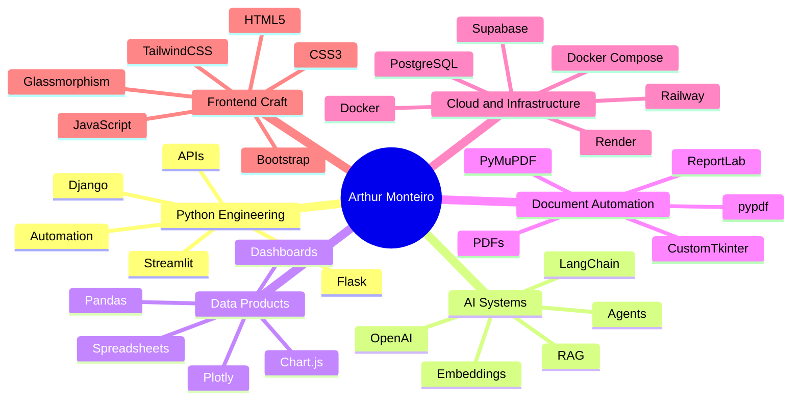

<!-- README.md | GitHub Profile: monteiro-lab -->
<!-- Feather icons below are loaded through Iconify so they keep the Feather style with color accents. -->

<div align="center">


<br/>

[](https://git.io/typing-svg)

<br/>


<br/><br/>

<a href="https://github.com/monteiro-lab">
  
</a>

<!-- Add your real links below when available -->
<!--
<a href="https://www.linkedin.com/in/YOUR-LINKEDIN">
  
</a>

<a href="mailto:your.email@example.com">
  
</a>
-->

</div>

---

##  About Me

I am **Arthur Monteiro**, a Python-oriented developer focused on turning operational problems into elegant, reliable, and scalable digital products.

My work combines **backend engineering**, **data automation**, **interactive dashboards**, **document processing**, **AI-powered workflows**, **API integrations**, **database-driven systems**, and **modern user interfaces**.

I enjoy building tools that are not only technically solid, but also useful, polished, and ready to solve real business problems.

---

##  Core Engineering Focus

<table>
  <tr>
    <td width="50%">
      <h3>
        
        Backend Systems
      </h3>
      <p>
        Building structured Python applications with Flask, Django, SQLAlchemy, Alembic, REST APIs, authentication flows, background jobs, and production-ready deployment patterns.
      </p>
    </td>
    <td width="50%">
      <h3>
        
        Data Products
      </h3>
      <p>
        Creating dashboards, analytical tools, and spreadsheet workflows using Pandas, Streamlit, Plotly, Chart.js, CSV/XLSX processing, and automated reporting.
      </p>
    </td>
  </tr>
  <tr>
    <td width="50%">
      <h3>
        
        AI Automation
      </h3>
      <p>
        Designing AI-enhanced systems with LangChain, OpenAI, RAG pipelines, embeddings, pgvector, Supabase, and workflow automation through tools such as n8n.
      </p>
    </td>
    <td width="50%">
      <h3>
        
        Document Engineering
      </h3>
      <p>
        Developing PDF and document automation tools with PyMuPDF, pypdf, ReportLab, pdf.js, fabric.js, TinyMCE, and desktop interfaces using CustomTkinter.
      </p>
    </td>
  </tr>
</table>

---

##  Tech Stack

<div align="center">

### Languages


<br/><br/>

### Backend, APIs and Databases


<br/><br/>

### Cloud and Workflow Tooling


<br/><br/>

### Frontend and UI


</div>

---

##  Stack DNA

<div align="center">


</div>

---

##  Featured Projects

<table>
  <tr>
    <td width="50%">
      <h3>
        
        CalendAI PRO
      </h3>
      <p>
        AI-powered scheduling platform built with Flask, LangChain, OpenAI, Supabase/PostgreSQL, Google OAuth, and Google Calendar API.
      </p>
      <p>
        
        
        
        
        
        
      </p>
      <a href="https://github.com/ndmg-dev/CalendarAI_PRO">View repository</a>
    </td>
    <td width="50%">
      <h3>
        
        Ouvidoria MG
      </h3>
      <p>
        Corporate ombudsman platform with Google Workspace authentication, Supabase, RAG pipeline, pgvector, n8n, and AI assistance.
      </p>
      <p>
        
        
        
        
        
      </p>
      <a href="https://github.com/ndmg-dev/ouvidoria-mg">View repository</a>
    </td>
  </tr>

  <tr>
    <td width="50%">
      <h3>
        
        Dollar Tracker
      </h3>
      <p>
        Flask dashboard for USD/BRL exchange rate monitoring, historical storage, scheduled updates, statistical analysis, and interactive charts.
      </p>
      <p>
        
        
        
        
        
      </p>
      <a href="https://github.com/monteiro-lab/dolar-tracker">View repository</a>
    </td>
    <td width="50%">
      <h3>
        
        DataFlow
      </h3>
      <p>
        Streamlit application for cleaning, transforming, analyzing, and exporting CSV/XLSX spreadsheets with dynamic metrics and charts.
      </p>
      <p>
        
        
        
        
      </p>
      <a href="https://github.com/monteiro-lab/dataflow">View repository</a>
    </td>
  </tr>

  <tr>
    <td width="50%">
      <h3>
        
        Cotidiano PDF Studio
      </h3>
      <p>
        Desktop application for PDF editing, merging, text extraction, page extraction, and visual document manipulation.
      </p>
      <p>
        
        
        
        
        
      </p>
      <a href="https://github.com/monteiro-lab/cotidiano-pdf-studio">View repository</a>
    </td>
    <td width="50%">
      <h3>
        
        FiscalPro
      </h3>
      <p>
        Django-based fiscal analysis platform for ICMS calculations, Excel uploads, interactive analytics, reports, and cloud deployment.
      </p>
      <p>
        
        
        
        
      </p>
      <a href="https://github.com/monteiro-lab/FiscalPro">View repository</a>
    </td>
  </tr>
</table>

---

##  Project Labs

| Project | Technical Focus | Stack |
|---|---|---|
| [Sky Stars](https://github.com/monteiro-lab/Sky-Stars) | Interactive star map, data-driven rendering, geometry, and immersive UI | JavaScript, HTML5, CSS3, Feather Icons |
| [Movie Recommender Flask](https://github.com/monteiro-lab/movie-recommender-flask) | Recommendation experience with IMDb/TMDb data, scraping, and API integration | Flask, Requests, BeautifulSoup, TMDb API |
| [Webscraper Quotes](https://github.com/monteiro-lab/webscraper-quotes) | Sync and async web scraping with desktop interface | Python, Flet, httpx, asyncio, BeautifulSoup |
| [PDF Wizard](https://github.com/monteiro-lab/pdfwizard) | Web-based PDF editing, canvas tools, watermarking, merge, and extraction | Flask, PyMuPDF, pypdf, pdf.js, fabric.js, TinyMCE |
| [GridX](https://github.com/monteiro-lab/GridX) | Windows spreadsheet editor and analyzer | Python, Jupyter, data analysis, desktop tooling |

---

##  Engineering Map



---

##  What I Build

```txt
╭──────────────────────────────────────────────────────────────╮
│  Python web applications                                     │
│  AI-powered workflows and RAG systems                        │
│  Data dashboards and business intelligence tools             │
│  Spreadsheet automation and analytical pipelines             │
│  PDF processing and document productivity platforms          │
│  API integrations and cloud-connected applications           │
│  Desktop tools for operational efficiency                    │
╰──────────────────────────────────────────────────────────────╯
```

---

##  Tools and Platforms

<div align="center">


</div>

---

##  GitHub Analytics

<div align="center">


<br/><br/>


<br/><br/>


</div>

---

##  GitHub Trophies

<div align="center">


</div>

---

##  Development Philosophy

```txt
Clean code. Useful interfaces. Reliable automation.
Data-driven decisions. AI where it adds real value.
Products that solve problems, not just repositories that store code.
```

---

<div align="center">

### `build real solutions • automate workflows • transform data into intelligence`

<br/>


</div>
